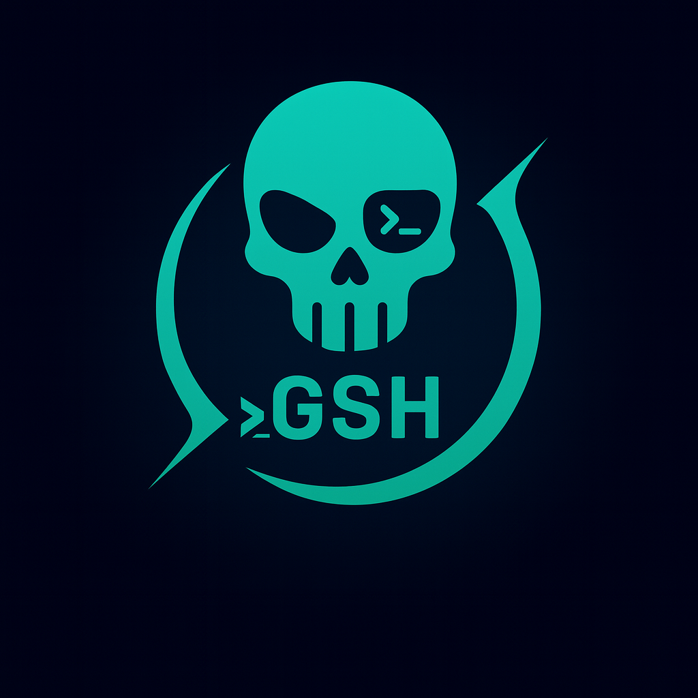

<p align="center">
  
</p>


# GShell

**File Extension:** `.gsh`  
**Tagline:** A modern shell for the post-bash era.

---

## ✨ Overview

GShell (`gshell`) is a next-generation Linux shell designed to replace Bash, Zsh, and Fish with a modern, secure, and extensible foundation.  
It blends the familiarity of classic shells with Flash-powered ergonomics, Flare-backed configuration, and a roadmap toward async I/O and Ghost ecosystem integrations.

---

## 🎯 Features

- **CLI Experience (Flash)**
  - Subcommands for `init` and `completions`
  - Flag preprocessing for scripts (`-c`, positional files)
  - Bash/Fish/Zsh completion generation

- **Configuration (Flare)**
  - Layered defaults + `~/.gshrc` + environment overrides
  - `GSHELL__`-prefixed variables (`GSHELL__PROMPT`, etc.)
  - Schema validation with clear error reporting

- **Shell Runtime**
  - POSIX-inspired parser and executor
  - Configurable prompt, theme, and plugin scaffolding
  - Script and REPL modes with consistent exit handling

- **Unicode Fidelity (gcode)**
  - Grapheme-aware backspace and cursor updates in raw mode
  - Accurate column width detection for emoji, CJK, and combining marks
  - Arrow/Home/End/Delete navigation with precise cursor rewinds
  - Terminal-safe prompt rendering without stray artifacts

---

## 🚀 Quick Start

```bash
# Launch the interactive shell
gshell

# Run a one-liner (non-interactive)
gshell -c "echo hi"

# Execute a .gsh script (passes the remaining args through)
gshell ./script.gsh arg1 arg2

# Scaffold a config file (respects --config and --force)
gshell init

# Print shell completions for the current shell
gshell completions bash
```

```bash
# Execute a .gsh script
gshell myscript.gsh
```

## 🛠️ Configuration (Flare)

GShell layers configuration using [Flare](https://github.com/ghostkellz/flare):

1. **Built-in defaults** – sensible prompt, interactive mode enabled.
2. **Config file** – TOML file at `~/.gshrc` (or the path supplied via `--config` / `GSHELL_CONFIG`).
3. **Environment overrides** – any `GSHELL__`-prefixed variable will override file values (e.g. `GSHELL__INTERACTIVE=false`).

Run `gshell init` (or `gshell --config /other/path init`) to scaffold a TOML config with inline documentation.  You can also set `GSHELL_CONFIG` to point at a different file for subsequent runs.  Keys currently supported:

- `prompt` (string)
- `interactive` (bool)
- `theme` (optional string)
- `plugins` (list of strings)
- `history_file` (optional string)
- `editor` (optional string)

When multiple layers specify the same field, precedence is **CLI path override → environment → file → defaults**.  Validation errors surface with actionable messages so you can correct malformed TOML quickly.

The starter config emitted by `gshell init` is Unicode-safe and annotated in-line so it's easy to tweak:

```toml
# ~/.gshrc — generated by `gshell init`
# Format: TOML (parsed by Flare)
# Variables: ${user}, ${host}, ${cwd}, ${git}, ${exit_status}
# Tip: Override any key via env vars like GSHELL__PROMPT="..."

prompt = "🪐 ${user}@${host} ${cwd} › "
interactive = true
theme = "powerlevel10k:lean"
plugins = ["git"]
history_file = "${HOME}/.local/share/gshell/history"
editor = "nvim"

# Uncomment to explore extra plugin locations
# plugin_paths = ["${XDG_CONFIG_HOME}/gshell/plugins"]
```

## 🎨 Unicode Handling (gcode)

When `gshell` runs interactively on a TTY, it switches to a gcode-powered raw line editor. The editor tracks grapheme clusters, emoji width, and combining marks so backspace and cursor redraw stay accurate across every Unicode edge case. Prompts are also rendered through gcode to avoid trailing artifacts when switching between narrow and double-width glyphs.
Navigation keys are supported too: left/right arrows move by grapheme, Home/End jump to start/end, and Delete removes the next cluster without mangling emoji.

## ✨ Zig Integration

You can embed GShell as a library in your own Zig project, or run the CLI directly.
```bash
zig fetch --save https://github.com/ghostkellz/gshell/archive/refs/head/main.tar.gz
```
